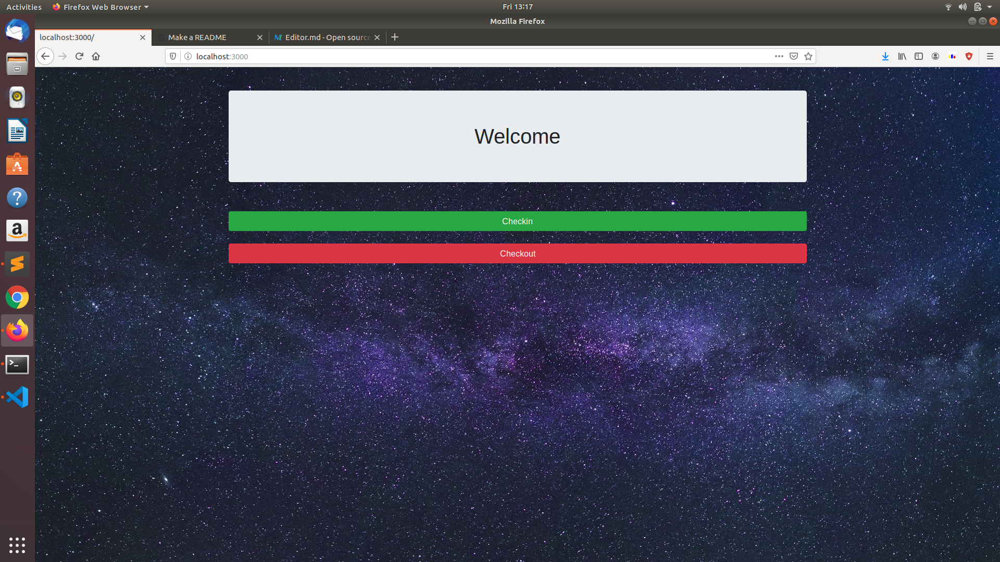
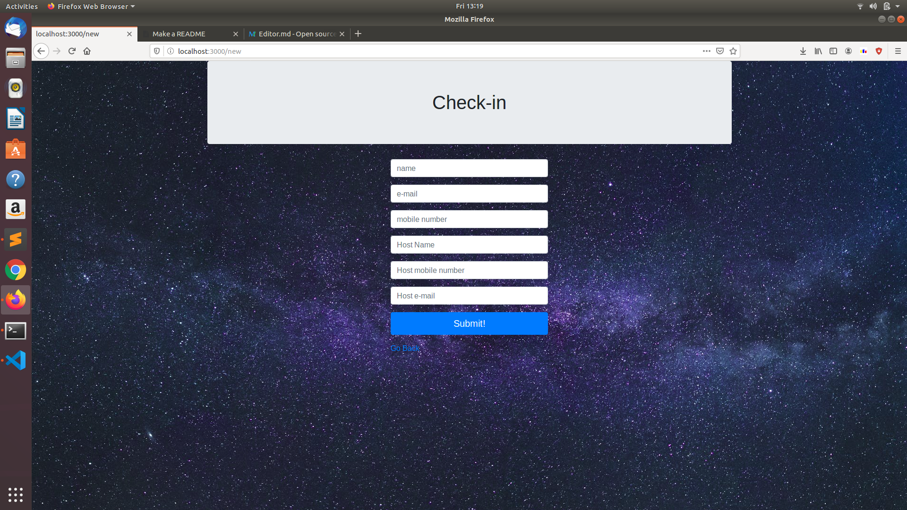
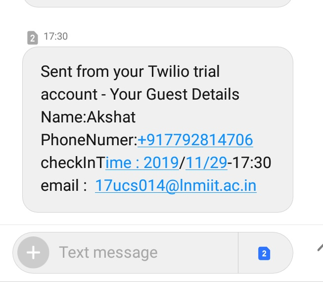
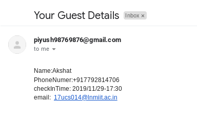
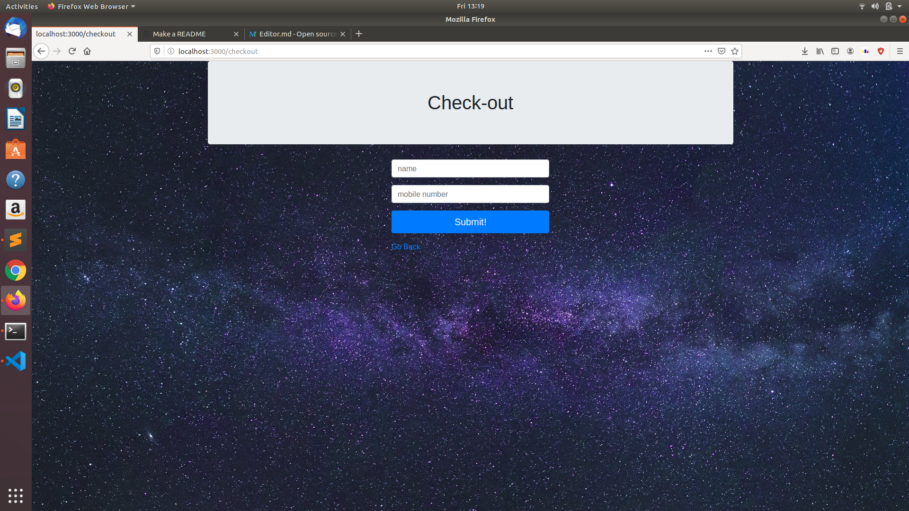
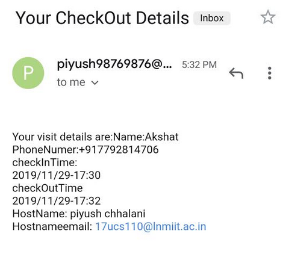
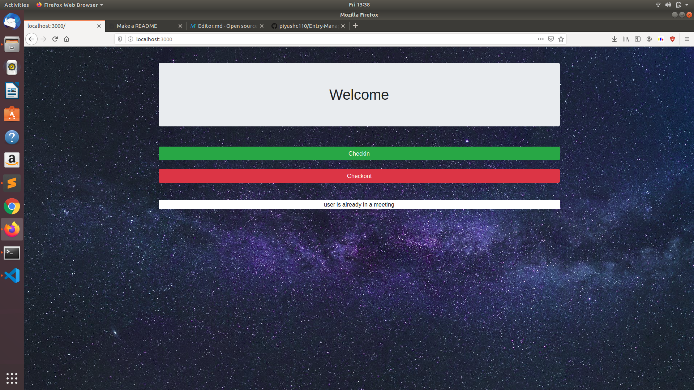
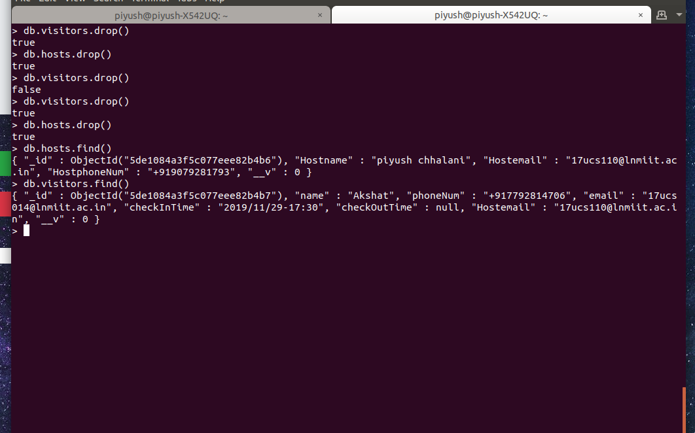

# Entry Management Software

## Introduction
     
This is an Entry Management Software, which stores the user's checkin and checkout details. And when a user checks in his deatis are sent to host via SMS and Email and whe a user checks out his visit details are sent to him via SMS and Email.

## Tech Stack

#### Front End:
HTML,CSS,BOOTSTRAP

#### Back End:
Node.Js

#### Back End tools:
Nodemailer, Twilio,ExpressJs

#### Database:
MongoDB

## Basic Workflow

##### landing page

##### When a visitors comes to check in he will get to a page to fill his details

##### As soon as visitor checks in his details are stored in our database and a sms and an email sent to Host containing visitor details
###### SMS screenshot

###### Email screenshot

##### When a visitors wants to checkout, he gets to checkout page and has to enter his name and  phone number(primary key)

 ##### He will get an email of successfully checking out, containing details of his visit.

###### Email screenshot

## Highlights

### Errors display
##### For checkin, when the user details are entered for a user who is already checked in, Error message is displayed

##### For checkout, when the user details are entered for a user who is not checked in, Error message is displayed

### To Eliminate the redundancy in database:
##### Since the number of visitors would be far greater than number of hosts, two collections are made, one for visitor details and another for host details, and visitor details contains primary key of hosts collection  'host-email' (to map and retrieve other host details from host collection).

##### visitors collection & hosts collection db view

## Setup
-  Clone the Project.
-  Extract the zip file in Project folder.
-  open the terminal.
-  use `cd project` to enter in the folder.
-  run `npm install` to install dependancies.

-  To use the SMS and Email facility you have to enter your creditentials

     For SMS:
     
     Add your Sid and authToken
     
     Enter your twilio Number at given space under path app.post('/checkin)->Visitor.find->Visitor.create
     
     For Email:
     
     Enter email id and password in attributes of transporter variable
     
     Enter email id at two places:
     
     1: app.post('/checkout')->Visitor.find->Visitor.create->mailOptions
     
     2: app.post('/checkout')->Visitors.find->Host.find->Host.updateOne->mailOptions

-  Then run `node app.js`.
-  Visit localhost:3000 to view your web page.

